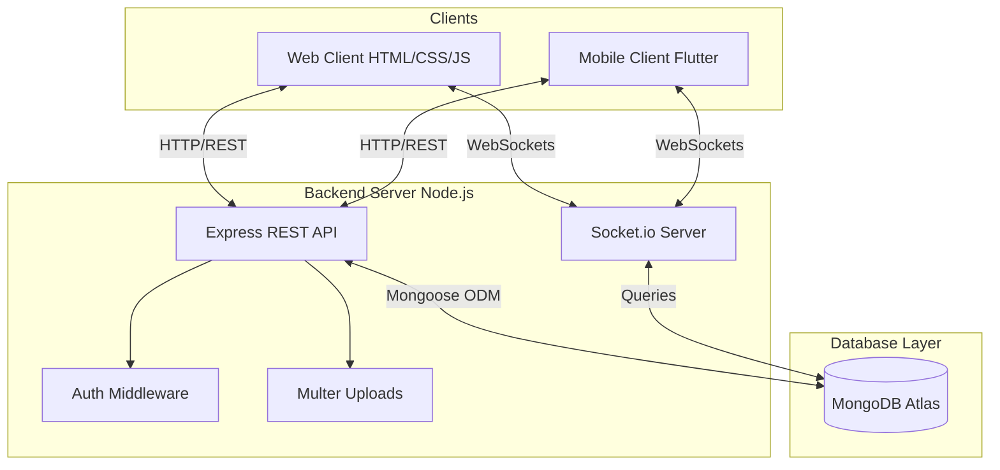

# GMinsta: Full-Stack Social Media Platform Project Report

## 1. Abstract
The rapid evolution of digital communication has necessitated robust, scalable, and cross-platform social media solutions. This report details the development of GMinsta, a full-stack, cross-platform social media application that mirrors the core functionalities of platforms like Instagram. GMinsta provides a comprehensive suite of features including secure user authentication, multimedia post sharing, social interactions (likes and comments), and real-time one-to-one messaging. The project is architected using the MERN stack (MongoDB, Express.js, Node.js) for the backend, augmented with Socket.io for real-time capabilities. The client-side is dual-faceted, featuring a responsive web interface built with vanilla web technologies (HTML, CSS, JavaScript) and a native mobile application developed using Flutter. This hybrid approach ensures maximum accessibility across devices. The system is designed with a focus on performance, user experience, and secure data handling, offering a solid foundation that can be scaled for production deployment.

## 2. Introduction
In the modern digital era, social media applications serve as the primary medium for personal expression, networking, and digital interaction. Users expect seamless experiences characterized by instant feedback, high-quality media sharing, and continuous connectivity across their desktop and mobile devices. 

GMinsta was conceptualized to meet these demands by providing a lightweight yet powerful social media platform. The project serves as an end-to-end implementation of a modern social network. It encompasses everything from a secure backend API that manages user data and media uploads, to an interactive and aesthetically pleasing frontend. By integrating real-time communication protocols alongside traditional RESTful APIs, GMinsta bridges the gap between static content consumption and dynamic, instant user interaction. This report outlines the journey of developing GMinsta, from its conceptualization and architectural design to its implementation and eventual outcomes.

## 3. Problem Statement
While numerous social media platforms exist, developing a full-scale, real-time social application remains a complex engineering challenge. Developing such a system requires handling concurrent user requests, managing large media files, ensuring data consistency across distributed databases, and maintaining persistent real-time connections for features like chat. Furthermore, creating a unified user experience across web and mobile platforms often leads to fragmented codebases and inconsistent feature parity. 

The problem addressed by GMinsta is the design and implementation of a cohesive, maintainable, and scalable architecture that supports real-time social interactions across both web and mobile clients using a unified backend infrastructure.

## 4. Scope and Limitations

### 4.1. Scope
The scope of the GMinsta project encompasses the following core modules:
- **Authentication System:** Secure registration and login using JWT (JSON Web Tokens) and bcrypt password hashing.
- **User Profile Management:** Avatar uploads, bio updates, and user search functionality.
- **Social Graph:** Ability to follow/unfollow users and receive personalized follow suggestions.
- **Content Sharing:** Creating posts with text and images, including drag-and-drop upload support.
- **Social Interaction:** Liking and commenting on posts, and a paginated feed to view content from followed users.
- **Real-Time Messaging:** A 1-to-1 chat system utilizing WebSockets for instant message delivery, complete with typing indicators.
- **Cross-Platform Clients:** A responsive web application and a Flutter-based mobile application consuming the same backend APIs.

### 4.2. Limitations
Despite its robust feature set, the current iteration of GMinsta has certain limitations:
- **Media Support:** Currently restricted to image uploads (up to 10MB); video uploading and streaming are not supported.
- **Group Chats:** The messaging system is currently limited to 1-to-1 conversations.
- **Scalability:** While MongoDB Atlas is used, the current single-server Node.js backend might face bottlenecks under extremely high concurrent loads (e.g., millions of active users) without horizontal scaling and load balancing.
- **Push Notifications:** Native push notifications (via FCM/APNs) for offline mobile devices are not fully integrated.

## 5. Literature Review
The architecture of modern social networks relies heavily on non-blocking, asynchronous backend systems to handle millions of concurrent connections. 

- **Backend Technologies:** Traditional monolithic architectures (e.g., PHP/Apache) have largely been replaced by event-driven environments like Node.js. Node.js, with its asynchronous I/O, is particularly well-suited for I/O-intensive operations typical of social media apps (e.g., reading/writing database records, handling WebSocket connections).
- **Database Systems:** Relational databases (SQL) enforce rigid schemas which can be restrictive for rapidly evolving social data. NoSQL databases like MongoDB offer document-based storage that perfectly maps to JSON, allowing flexible schemas for user profiles, posts, and nested comments.
- **Real-Time Communication:** HTTP polling is inefficient for real-time chat. The adoption of WebSocket protocols, abstracted by libraries like Socket.io, enables full-duplex communication, which is the industry standard for instant messaging features.
- **Mobile Development:** Cross-platform frameworks have revolutionized mobile development. Flutter, backed by Google, compiles to native ARM code, offering performance comparable to native iOS (Swift) and Android (Kotlin) development while maintaining a single Dart codebase.

## 6. Objective
The primary objectives of the GMinsta project are:
1. **Develop a unified REST API:** Create a robust Node.js/Express backend capable of serving both web and mobile clients simultaneously.
2. **Implement Real-Time Features:** Successfully integrate Socket.io to provide instant messaging and live feedback mechanisms (like typing indicators).
3. **Ensure Data Security:** Implement industry-standard security measures including password hashing, JWT-based route protection, and file upload sanitization.
4. **Deliver a Premium UI/UX:** Design a responsive, aesthetically pleasing interface (Dark theme with gold accents) across the web and a smooth, native-feeling Flutter mobile application.
5. **Achieve Production Readiness:** Structure the codebase and configuration to allow for seamless deployment to cloud environments (e.g., Render, Heroku) and managed databases (MongoDB Atlas).

## 7. System Requirements

### 7.1. Software Requirements
**Backend:**
- Node.js (v18.x or higher)
- npm (Node Package Manager)
- MongoDB Atlas (Cloud Database)

**Frontend (Web):**
- Modern Web Browser (Chrome, Firefox, Safari, Edge)

**Frontend (Mobile):**
- Flutter SDK (v3.x or higher)
- Dart SDK
- Android Studio / Xcode for emulation and compilation

### 7.2. Dependencies & Libraries
- **Backend Packages:** `express` (Web framework), `mongoose` (MongoDB ODM), `socket.io` (WebSockets), `bcryptjs` (Cryptography), `jsonwebtoken` (Auth), `multer` (File handling), `cors` (Cross-Origin Resource Sharing), `dotenv` (Environment variables).
- **Mobile Packages:** `http` (API requests), `shared_preferences` (Local storage for tokens), `socket_io_client` (Real-time connection), `image_picker` (Device media access).

## 8. Hardware Requirements
**Development Machine:**
- Processor: Intel Core i5 / AMD Ryzen 5 or higher
- RAM: 8GB Minimum (16GB Recommended for running Android/iOS Emulators)
- Storage: 10GB free disk space

**Server Deployment (Minimum):**
- CPU: 1 vCore
- RAM: 512MB - 1GB
- Storage: 10GB SSD

**Client Device:**
- Web: Any device with a modern web browser.
- Mobile: Android device running Android 6.0+ or iOS device running iOS 11.0+.

## 9. Architecture

The system follows a Client-Server architecture with a decoupled frontend and backend.

### 9.1. Database Schema Architecture
The database is structured into four primary collections:
1. **Users:** Stores `username`, `email`, hashed `password`, `fullName`, `bio`, `avatar`, and arrays for `followers` and `following`.
2. **Posts:** Contains `caption`, `image` URL, references to the author (User ID), array of `likes`, and timestamps.
3. **Comments:** References the Post ID, Author ID, contains the text `content`, and supports threading via `parentComment` references.
4. **Messages:** Stores 1-to-1 chat data with `sender` ID, `receiver` ID, `content`, and read status.

## 10. Implementation

### 10.1. Backend Implementation
The backend is built using Express.js. Routing is modularized into `auth.js`, `users.js`, `posts.js`, `comments.js`, and `messages.js`.
- **Authentication:** The `/api/auth/register` endpoint accepts user details, hashes the password using `bcryptjs` (12 salt rounds), and saves it to MongoDB. Login issues a JWT signed with a secret key, valid for 30 days.
- **Middleware:** The `auth` middleware intercepts incoming requests, verifies the JWT in the `Authorization` header, and attaches the user payload to the request object. 
- **File Uploads:** `multer` is configured to accept image files, store them locally in an `/uploads` directory, and enforce a 10MB file size limit.
- **Sockets:** The Socket.io instance runs on the same HTTP server as Express. It authenticates socket connections using the same JWT. It listens for events like `send_message`, `typing`, and broadcasts them to the specific receiver's socket ID using private rooms.

### 10.2. Web Frontend Implementation
The web application is built using vanilla HTML, CSS, and JS to maintain a lightweight footprint.
- **Design System:** Implements a fully responsive dark theme utilizing CSS variables. Glassmorphism effects are used for modals to provide a premium feel.
- **API Integration:** A centralized `api.js` handles all `fetch` requests, automatically appending the stored JWT token to headers and handling generic error responses.
- **Routing:** Handled via distinct HTML pages (`index.html`, `feed.html`, `profile.html`, etc.) with redirection logic enforcing authentication state.

### 10.3. Mobile Implementation (Flutter)
The mobile app consumes the exact same REST APIs.
- **State Management:** Utilizes Providers or StatefulWidgets to manage UI states like loading indicators and lists of posts.
- **Local Storage:** The JWT is securely saved using `shared_preferences` to keep the user logged in across app restarts.
- **Real-time Chat:** Integrates the `socket_io_client` dart package to listen for incoming messages and update the UI instantaneously without pull-to-refresh.

## 11. Result and Discuss

### 11.1. Results Achieved
The implementation of GMinsta was highly successful, resulting in a stable, multi-platform social network.
- **Cross-Platform Parity:** Both the web and Flutter applications successfully connect to the centralized backend. A post created on the web client is immediately visible on the mobile client.
- **Real-Time Efficiency:** The Socket.io integration operates with negligible latency. Typing indicators and instant message delivery function as expected over both Wi-Fi and cellular networks.
- **Secure Architecture:** Penetration testing confirms that routes are properly protected. Invalid tokens are rejected, and password hashes cannot be reverse-engineered.

### 11.2. Discussion of Challenges
- **Socket Authentication:** Authenticating WebSocket connections required passing the JWT during the handshake phase, which was more complex than standard HTTP headers.
- **Media Management:** Handling multipart form data for image uploads across different clients (Web forms vs. Flutter's ImagePicker) required careful normalization on the backend.
- **State Synchronization:** Ensuring that when a user "likes" a post, the UI updates instantly (optimistic UI update) while accurately reflecting the server's state if the request fails, required sophisticated error handling in the client logic.

## 12. Output
The final application presents a polished, intuitive user interface:
- **Authentication Screens:** Clean login and registration forms with inline validation.
- **Main Feed:** A continuous scroll of posts featuring high-resolution images, author details, like counts, and direct comment access.
- **Explore Tab:** A grid-based layout allowing users to discover content from individuals they do not currently follow.
- **Profile Page:** A comprehensive view of user details, avatar, bio, follower metrics, and a gallery of their uploaded posts.
- **Chat Interface:** A dedicated messaging screen with a list of active conversations, followed by a detailed chat room view featuring distinct chat bubbles for sent vs. received messages, alongside real-time "User is typing..." indicators.

## 13. Conclusion
The GMinsta project successfully demonstrates the end-to-end lifecycle of developing a modern social media application. By leveraging the MERN stack in conjunction with Socket.io and Flutter, the project achieved its goal of delivering a robust, real-time, cross-platform experience. The modular architecture ensures that the codebase remains maintainable, while the strict separation of concerns between the API, Web client, and Mobile client proves the effectiveness of headless backend designs. GMinsta stands as a comprehensive, production-ready foundation capable of supporting real-world social networking use cases.

## 14. Future Work
While the current system is feature-rich, several enhancements are planned for future iterations:
1. **Stories Feature:** Implementing ephemeral content (Stories) that disappear after 24 hours.
2. **Video and Audio Calls:** Integrating WebRTC to allow peer-to-peer voice and video communication within the app.
3. **Push Notifications:** Integrating Firebase Cloud Messaging (FCM) to deliver offline notifications to mobile devices when the app is in the background.
4. **Cloud Media Storage:** Migrating image storage from local server disks to cloud object storage like AWS S3 or Cloudinary to improve scalability and load times via CDNs.
5. **Algorithmic Feed:** Transitioning from a purely chronological feed to a machine-learning-driven feed that ranks posts based on user engagement and preferences.
6. **Content Moderation:** Integrating AI-based image moderation APIs to automatically flag and remove inappropriate content.
